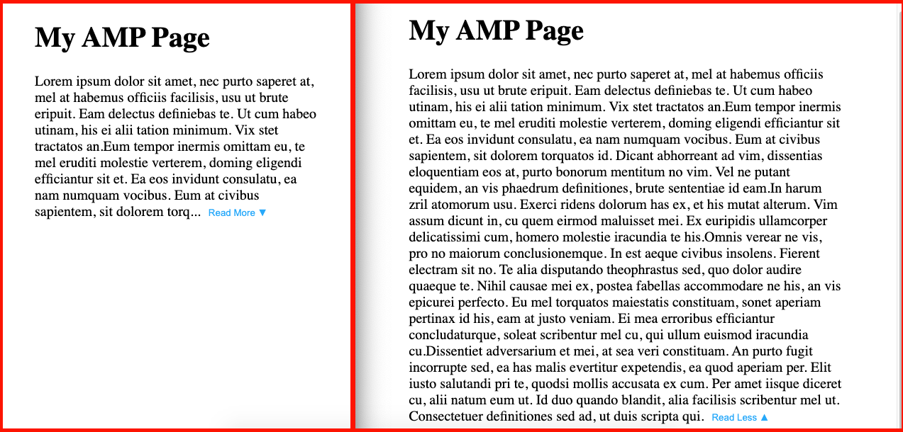

AMP Read More/Less body pure text

### Sample result:


### AMP Html required mark-up according to the [official doc](https://amp.dev/documentation/guides-and-tutorials/start/create/basic_markup/?format=websites)

AMP HTML documents MUST:

Rule | Description
---------|----------
Start with the <!doctype html> doctype. | Standard for HTML.
Contain a top-level <html ⚡> tag(<html amp> is accepted as well). | Identifies the page as AMP content.
Contain <head> and <body> tags. | Optional in HTML but not in AMP.
Contain a <meta charset="utf-8"> tag as the first child of their <head> tag. | Identifies the encoding for the page.
Contain a <script async src="https://cdn.ampproject.org/v0.js"></script> tag inside their <head> tag. As a best practice, you should include the script as early as possible in the <head>. | Includes and loads the AMP JS library.
Contain a <link rel="canonical" href="$SOME_URL"> tag inside their <head>. | Points to the regular HTML version of the AMP HTML document or to itself if no such HTML version exists. Learn more in Make Your Page Discoverable.
Contain a <meta name="viewport" content="width=device-width,minimum-scale=1,initial-scale=1"> tag inside their <head> tag. It's also recommended to include initial-scale=1. | Specifies a responsive viewport. Learn more in Create Responsive AMP Pages.
Contain the AMP boilerplate code in their <head> tag. | CSS boilerplate to initially hide the content until AMP JS is loaded.


### Implementation

+ add _amp-bind_ script to the page
```
  <script async custom-element="amp-bind" src="https://cdn.ampproject.org/v0/amp-bind-0.1.js"></script>
```

+ `<amp-state>`
> State: A document-scope, mutable JSON state. State variables update in response to user actions. amp-bind does not evaluate expressions on page load. Visual elements should have their default "state" defined and not rely amp-bind for initial render.

```
<amp-state id="myContent">
    <script type="application/json">
    {
        "all": {
            "text": "all of the content."
        },
        "part": {
            "text": "part of the content..."
        }
    }
    </script>
</amp-state>
```

+ `[property]` 

Place the "Default Text" with initialize/placeholder content. In the "Read More/Less" model, the default text should be the same as 'part of the content...' so that the page displays and interacts more frequently.  

> Special attributes that link an element's property to a state via an expression. A property is bound by wrapping it inside brackets, in the form of [property]
```
<div>
    <p [text]="myContent[currentState].text">Default Text</p>
    <button class='more-less-btn'
        on="tap:AMP.setState({currentState: 'all'})">Read More ▼</button>
</div>
```

+ setState for button text display
In this example, use `allShow` to catch every tap of the button then decide the text on button.
```
<div>
    <p [text]="myContent[currentState].text">Default Text</p>
    <button class='more-less-btn' 
        on="tap:AMP.setState({currentState: allShow ? 'part' : 'all', allShow: !allShow})" 
        [text]="allShow ? 'Read Less ▲' : 'Read More ▼'">Read More ▼</button>
</div>
```


+ `data-amp-bind-` 
> React and XML compatibility
If developing with React or XML, use the alternative data-amp-bind-property syntax. The `[` and `]` characters in attribute names is invalid XML, making the `[property]` syntax unavailable.    
Replace the property field with the name of the property you would like to define in data-amp-bind-property.    
For example, [text]="myState.foo" would become data-amp-bind-text="myState.foo".
```
<div class="show-part" data-amp-bind-class="myContent[currentState].class">
    <p class='context' data-amp-bind-text="myContent[currentState].text">Default Text</p>
    <button class='more-less-btn' 
        on="tap:AMP.setState({currentState: allShow ? 'part' : 'all', allShow: !allShow})" 
        data-amp-bind-text="allShow ? 'Read Less ▲' : 'Read More ▼'">Read More ▼</button>
</div>
```


